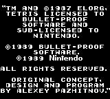
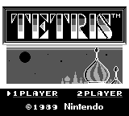
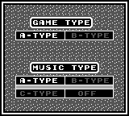
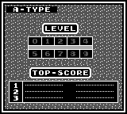
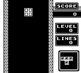
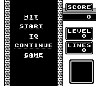
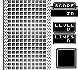
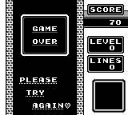
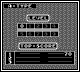

This folder contains screenshots of the different states of the game:

 opening credits

 player count selection menu

 game type selection menu

 level selection menu

 in game

 pause

 game ending, screen fills with bricks

 game over

 enter name for highscore

From these we can see that there are 5 different screens:

1. opening credits (screenshot 0)
2. player count selection menu (screenshot 1)
3. game type selection menu (screenshot 2)
4. level selection menu (screenshots 3 and 8)
5. in game (screenshots 4 to 7)

To find out which of these 5 screens we are in, we want to look at a small set
of pixels whose combination of colors uniquely identifies the current screen.

The program `finger_print.go` helps us find a good set of pixels for this
finger print. It takes as inputs 1) the set of images to differentiate between
and 2) a set of 2D points, the pixel positions to use as a finger print. It
then checks that the finger print for all given images is unique. If unique,
the finger prints are output so we can copy them to our bot code.

`finger_print.go` does not look for a good combination of pixels. That process
happens manually. This tool then helps verify the pixel set and outputs the
finger prints so we do not have to do that manually in an image editor.
